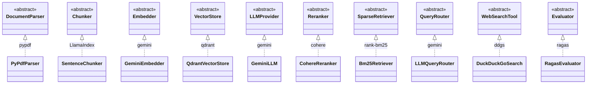
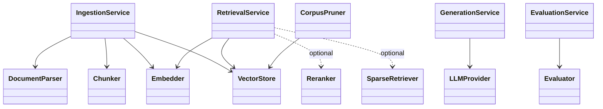
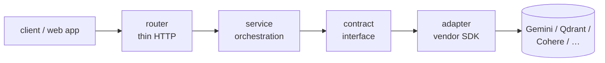
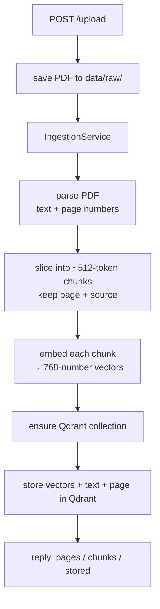
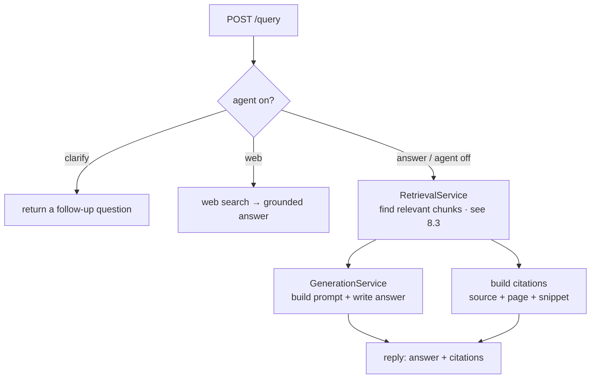
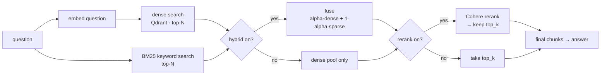
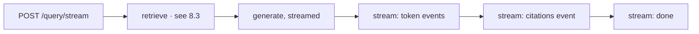

# FinQuery — Backend

> **Chat with company annual reports.** Upload a 10-K PDF, ask a question in plain English, and get a short, **source-cited** answer taken straight from the document — not a guess.

**🌐 Live in production:** **https://finquerybackend.onrender.com** · Interactive API: **https://finquerybackend.onrender.com/docs**

This repo is the **backend** (the brains + the API). The React web app lives in a separate `finQueryFrontend` repo and talks to this over the internet.

---

## 1. The basic idea (in plain English)

Imagine handing someone a 300-page annual report and asking *"what were Apple's total sales?"* — they'd flip to the right page, read it, and tell you the number **and** show you the page. FinQuery does exactly that, automatically.

It works in two phases:

**When you add a document:** the report is read, sliced into small passages, and each passage is turned into a "meaning fingerprint" that's saved in a special search database.

**When you ask a question:** the question gets the same fingerprint treatment, the system finds the handful of passages closest in meaning, and an AI writes an answer using **only** those passages — returning the source file and page number so you can verify it.

The whole system is one simple chain:

```
read → slice → fingerprint → store   →   find relevant slices → write a grounded answer (with citations)
```

Every file in this codebase is just doing one link of that chain.

**The one design rule worth knowing:** every external service (the AI, the search database) is swappable by editing **a single file**. Today it runs on **Google Gemini** (the AI) and **Qdrant** (the search database); switching to a different provider doesn't touch the rest of the system.

---

## 2. Tech stack

| Layer | Technology |
|---|---|
| API framework | Python 3.13 + **FastAPI** (async), Pydantic v2 |
| Config | pydantic-settings (`.env`) |
| PDF reading | **pypdf** |
| Slicing (chunking) | **LlamaIndex** `SentenceSplitter` |
| Meaning fingerprints (embeddings) | **Gemini** `gemini-embedding-001` (768 numbers per slice) |
| Answer writing (LLM) | **Gemini** `gemini-2.5-flash` |
| Search database (vectors) | **Qdrant** — Docker locally, **Qdrant Cloud** in production |
| Keyword search | **BM25** (`rank-bm25`) — optional, for exact-term matching |
| Re-ranking | **Cohere** — optional, sharper relevance |
| Quality scoring | **RAGAS** (AI-as-judge) |
| Hosting | **Render** (backend) + **Qdrant Cloud** (database) |
| Testing | **pytest** (fake-backed, needs zero infrastructure) |

---

## 3. Try it live (no setup)

The backend is deployed, so you can poke it from any terminal. Point everything at the production URL:

```bash
# Is it awake?
curl https://finquerybackend.onrender.com/health

# Ask a question (a document is already loaded)
curl -X POST https://finquerybackend.onrender.com/query \
  -H 'Content-Type: application/json' \
  -d '{"question":"What were Apple total net sales?"}'
```

The easiest way to explore every endpoint is the **interactive docs page**: https://finquerybackend.onrender.com/docs — click any endpoint, hit *Try it out*, get a real response. Full request/response details live in **[API_DOCS.md](API_DOCS.md)**.

> ⏳ **First request may be slow (~30–60s).** The free hosting tier puts the server to sleep when idle; the first call wakes it up, then it's fast. Just retry once.

---

## 4. Run it yourself

```powershell
# 1. Install
py -3.13 -m venv venv
.\venv\Scripts\Activate.ps1
pip install -r requirements.txt

# 2. Add your key
copy .env.example .env
#    open .env and set GEMINI_API_KEY=...   (free key: https://aistudio.google.com/apikey)

# 3. Start Qdrant — the search database that holds the document fingerprints.
#    This runs it locally in Docker and keeps the data in a named volume.
docker compose up -d qdrant

# 4. Run the server
uvicorn app.main:app --reload --port 8000
#    interactive docs at http://localhost:8000/docs

# 5. Add a document, then ask about it
curl -X POST http://localhost:8000/upload -F 'file=@data/raw/AppleInc.pdf;type=application/pdf'
curl -X POST http://localhost:8000/query -H 'Content-Type: application/json' -d '{"question":"What were Apple total net sales?"}'

# 6. Run the tests (no Qdrant, no key, no PDFs needed — everything is faked)
pytest -q
```

---

## 5. Project structure

Each line is what that file/folder does, in a few words.

```
finQueryBackend/
├── app/
│   ├── main.py                 # FastAPI app: CORS, error handlers, mounts routers
│   ├── config.py               # all settings, loaded from .env (one source of truth)
│   │
│   ├── core/                   # ── the backbone (no vendor code) ──
│   │   ├── interfaces.py       #   the "contracts" every component must satisfy
│   │   ├── domain.py           #   internal data objects (Chunk, SearchHit, EvalRun…)
│   │   ├── factory.py          #   the ONE place that picks which vendor is used
│   │   └── errors.py           #   app errors → clean HTTP responses
│   │
│   ├── processing/             # ── PDF → text → slices ──
│   │   ├── pdf_parser.py       #   reads PDF text, keeps page numbers
│   │   └── chunker.py          #   slices pages into ~512-token chunks
│   │
│   ├── clients/                # ── one file per outside service ──
│   │   ├── gemini_client.py    #   Gemini embeddings + answer generation (+ key rotation)
│   │   ├── qdrant_client.py    #   stores/searches vectors in Qdrant
│   │   ├── bm25_index.py       #   in-memory keyword (BM25) index
│   │   ├── cohere_client.py    #   Cohere re-ranking (optional)
│   │   ├── websearch_client.py #   DuckDuckGo web fallback (optional)
│   │   └── ragas_evaluator.py  #   RAGAS quality scoring (optional)
│   │
│   ├── services/               # ── the orchestration (uses contracts only) ──
│   │   ├── ingestion.py        #   add-a-document pipeline: parse→slice→embed→store
│   │   ├── retrieval.py        #   find relevant chunks (dense + BM25 + rerank)
│   │   ├── generation.py       #   build the prompt, get the grounded answer
│   │   ├── citations.py        #   turn hits into source+page citations
│   │   ├── agent.py            #   router: answer / clarify / web-search (optional)
│   │   ├── evaluation.py       #   runs the quality-scoring job
│   │   └── maintenance.py      #   prune the store down to a keep-list
│   │
│   ├── routers/                # ── thin HTTP layer (no vendor code) ──
│   │   ├── health.py           #   /health (alive) + /health/ready (deps ok)
│   │   ├── upload.py           #   /upload — add a document
│   │   ├── query.py            #   /query + /query/stream — ask a question
│   │   ├── evals.py            #   /evals — quality scores
│   │   └── admin.py            #   /admin/prune — secured corpus cleanup
│   │
│   └── models/
│       └── schemas.py          # the request/response shapes the web app sees
│
├── scripts/
│   ├── ingest_corpus.py        # bulk-load every PDF in data/raw/
│   ├── prune_corpus.py         # CLI twin of /admin/prune
│   ├── compare_retrieval.py    # dense-vs-hybrid comparison helper
│   └── make_sample_pdf.py      # generate a tiny test PDF
├── tests/                      # fakes.py + test_pipeline.py (fast, zero infra)
├── data/raw/                   # the annual-report PDFs (8 company 10-Ks)
├── docs/                       # architecture, evaluation, tuning log
├── API_DOCS.md                 # every endpoint, input/output examples
├── Dockerfile · docker-compose.yml · requirements.txt · .env.example
```

---

## 6. Low-Level Design (structure)

The backbone is **Ports & Adapters (Hexagonal)**: the core defines abstract **contracts** (`core/interfaces.py`); the outside world plugs in as **adapters** (`clients/`, `processing/`). The core never imports a vendor — vendors depend inward on the contracts. One file (`core/factory.py`) decides which adapter is used.

### 6.1 Contracts ↔ implementations



Contracts are kept **small** — a parser only parses, a reranker only reranks — so a new vendor implements one tiny contract, not a giant class.

### 6.2 Services depend only on contracts (never on a vendor)



Dashed arrows are the **optional, flag-gated** collaborators. When `ENABLE_RERANK` / `ENABLE_HYBRID` are off, the factory injects nothing and retrieval is the plain meaning-search path — additive design, no regression.

### 6.3 Request → response (every endpoint goes through these layers)



A router never touches a vendor; a vendor is reached only through a contract chosen by the factory.

---

## 7. Core concepts (what each piece actually does)

Now that you've seen the structure, here's what each part does and how they relate — read this before the flow diagrams below.

- **Document parser** (`pdf_parser.py`) — opens a PDF and pulls out the text **page by page**, remembering which page each bit came from so answers can cite a page.

- **Chunker** (`chunker.py`) — a full report is too big to search precisely, so it's cut into small passages called **chunks**. **`512`** is the target size of one chunk in *tokens* (~350–400 words): small enough to pinpoint the exact relevant passage, large enough to keep context. A small **overlap (50 tokens)** repeats a little text between neighbours so a sentence split across a boundary isn't lost.

- **Embedder** (`gemini_client.py`) — turns each chunk into a **vector**: a list of **768 numbers** capturing its *meaning*. Passages with similar meaning get similar vectors. This is what enables search-by-meaning instead of search-by-exact-words.

- **Vector store / Qdrant** (`qdrant_client.py`) — **Qdrant** is a database purpose-built to store those 768-number vectors and instantly find the ones closest to a query vector. A normal SQL database can't do fast nearest-neighbour search over vectors; Qdrant can. (Docker locally, Qdrant Cloud in production.)

- **Dense search** — the *meaning* search: embed the question, ask Qdrant for the chunks whose vectors are **closest** (cosine similarity). Great at synonyms and paraphrasing; can miss an exact keyword.

- **Sparse retriever / BM25** (`bm25_index.py`) — the classic *keyword* search. **BM25** is the standard formula that ranks chunks by how well the question's exact words match. Nails tickers, "Q4 2024", exact line-items that meaning-search blurs — but is blind to synonyms.

- **Hybrid search + fusion** — run **dense + BM25 together** and merge them. Their scores are on different scales, so each list is rescaled to 0–1, then blended: `alpha·dense + (1−alpha)·sparse`. **`HYBRID_ALPHA=0.5`** weights them equally (`1.0` = meaning only, `0.0` = keywords only). You get meaning *and* exact-term matching.

- **top-N vs top_k** — we deliberately **over-fetch** a wide pool of **N** candidates (`RETRIEVE_CANDIDATES=20`) so fusion/re-ranking have enough material, then keep only the final **`top_k` (=5)** best chunks to hand the AI. *top-N = the wide pool; top_k = the final few.*

- **Reranker** (`cohere_client.py`) — a second, smarter relevance pass. Dense and BM25 score each chunk **in isolation**; the reranker (Cohere) reads the **question and a chunk together** and re-scores true relevance, then keeps the `top_k`. It's slower, so it only runs on the small candidate pool — never the whole corpus. *How the three differ:* dense = vector closeness, BM25 = keyword overlap, rerank = question+chunk judged jointly by a model. Optional (`ENABLE_RERANK`).

- **LLM provider** (`gemini_client.py`) — the language model (Gemini `gemini-2.5-flash`) that **writes the answer**. It's given the question plus the retrieved chunks and told to answer **only** from them (this "grounding" is what prevents made-up facts).

- **Agent router** (`agent.py`) — an optional first step (`ENABLE_AGENT`) that decides *how* to handle a question before searching: **answer from docs**, **ask for clarification**, or **fall back to web search**.

- **RAGAS evaluation** (`ragas_evaluator.py`) — an automated grader that scores answer quality (faithfulness, relevancy…) using an **AI as the judge**, so quality is *measured*, not eyeballed.

---

## 8. How the flows work (diagrams)

### 8.1 Adding a document — `POST /upload`



### 8.2 Asking a question — `POST /query`



### 8.3 The assembled retrieval pipeline (inside `retrieve()`)



### 8.4 Streaming answer — `POST /query/stream`

Same retrieval as 8.3, but the answer is sent **word-by-word** so the UI "types it out" live, with the citations sent at the end.



---

## 9. Use cases

- **Financial research** — *"What risk factors does Tesla list?"*, *"What was Amazon's operating income?"* — answered from the actual filing, with a page citation to verify.
- **Q&A over any dense PDF corpus** — the engine is domain-agnostic; annual reports are just the demo set.
- **A reference for production RAG patterns** — contract-driven design, dependency injection, liveness/readiness split, fake-backed tests, secured admin ops, deployed to the cloud.

---

## 10. Learnings

- **Code to contracts, not vendors.** The same code runs on Gemini+Qdrant in production and on fakes in tests — and a vendor swap is one file.
- **One place decides "which vendor?"** (`factory.py`), so the choice never leaks across the codebase.
- **Separate internal data from the wire format**, so the engine and the API can change independently.
- **Liveness ≠ readiness** — splitting them is what lets the host restart a dead process but stop routing traffic to a temporarily-degraded one.
- **PDFs must be text-selectable** — an early image-only corpus extracted zero text (a real signal, not a crash); text-based 10-Ks fixed it instantly.
- **Free tiers have hard limits** — Gemini caps embeddings per minute; the system surfaces that as a clean "retry shortly" rather than a crash, and ingestion is paced accordingly.

---

## 11. Configuration reference (`.env`)

| Var | Default | Meaning |
|---|---|---|
| `EMBED_PROVIDER` / `LLM_PROVIDER` | `gemini` | which AI vendor (the swap point) |
| `VECTOR_STORE` | `qdrant` | which search database |
| `GEMINI_API_KEY` (+ `_2` / `_3`) | — | required; extra keys auto-rotate on rate-limit |
| `EMBED_MODEL` / `EMBED_DIM` | `gemini-embedding-001` / `768` | fingerprint model + size |
| `LLM_MODEL` | `gemini-2.5-flash` | answer-writing model |
| `QDRANT_URL` / `QDRANT_COLLECTION` | `http://localhost:6333` / `finquery_chunks` | search database location |
| `QDRANT_API_KEY` | — | blank locally; set for Qdrant Cloud (production) |
| `CHUNK_SIZE` / `CHUNK_OVERLAP` / `TOP_K` | `512` / `50` / `5` | slicing + how many chunks the AI sees |
| `ENABLE_HYBRID` / `HYBRID_ALPHA` | `false` / `0.5` | dense+BM25 fusion (`1.0`=meaning only, `0.0`=keywords only) |
| `ENABLE_RERANK` / `RERANK_MODEL` | `false` / `rerank-english-v3.0` | Cohere re-ranking (needs `COHERE_API_KEY`) |
| `RETRIEVE_CANDIDATES` | `20` | size of the over-fetch pool (top-N) before fuse/rerank |
| `ENABLE_AGENT` | `false` | router: answer / clarify / web |
| `ENABLE_WEB_SEARCH` / `WEB_SEARCH_PROVIDER` | `false` / `duckduckgo` | optional web fallback (keyless) |
| `EVAL_PROVIDER` / `EVAL_SAMPLE_SIZE` | `ragas` / `2` | quality scoring; keep small on the free tier |
| `ADMIN_API_KEY` | — | blank disables `/admin/*`; set to enable (sent as `X-Admin-Token`) |
| `FRONTEND_ORIGIN` | `http://localhost:5173` | which web app may call the API (CORS) |

> See [docs/tuning.md](docs/tuning.md) for current values + confidence levels, and [docs/tuning-runs.md](docs/tuning-runs.md) for logged retrieval comparisons.
