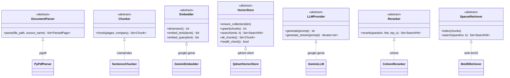
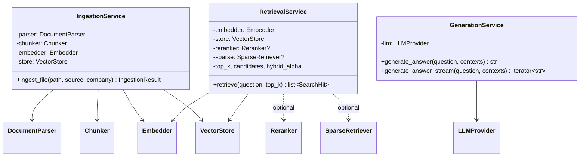
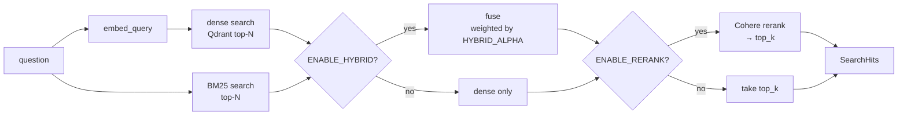
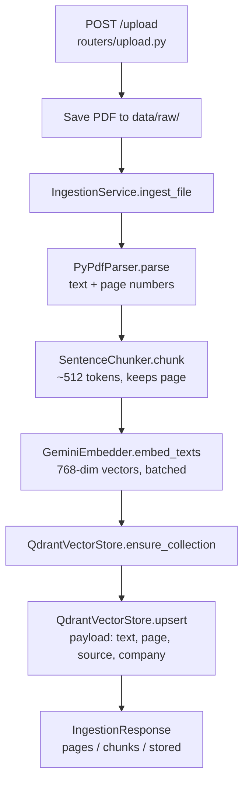
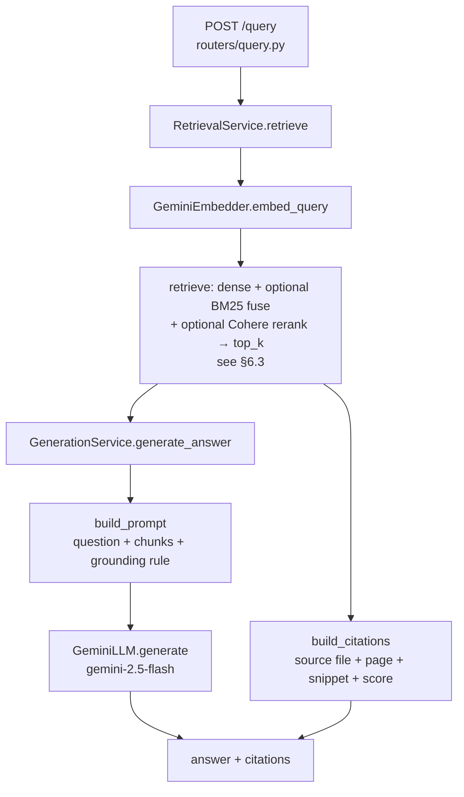
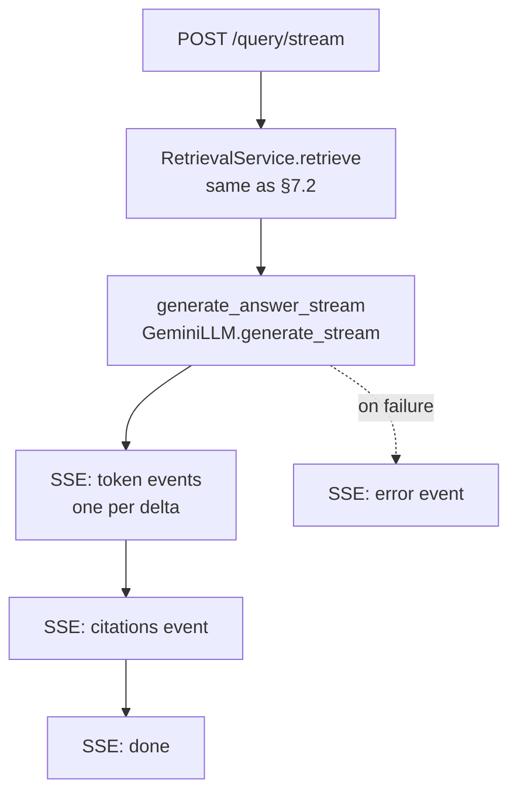

# FinQuery — Backend

> **Agentic RAG over company annual reports (10-Ks).** Upload an annual report PDF, ask a question in plain English, and get a concise, **source-cited** answer grounded in the document — not a hallucination.

This repo is the **backend** (the RAG engine + API). The React UI lives in a separate `finQueryFrontend` repo and talks to this over HTTP/SSE.

---

## 1. What this project is (the basic idea)

A user uploads annual-report PDFs. The backend **parses → chunks → embeds → stores** them in a vector database. When the user asks a question, the backend **embeds the question, retrieves the most relevant chunks, and an LLM writes an answer grounded only in those chunks**, returned with citations (source file + page).

The whole system is one mental model:

```
chunk → embed → store → retrieve → augment → generate → (evaluate)
```

Everything in the code is just implementing one of those steps.

**Design north star:** *vendor-swappable.* Today it runs on **Google Gemini** (embeddings + generation) and **Qdrant** (vector DB). Switching to OpenAI, or Qdrant → pgvector, is a **one-line change in a single factory file** — no service, router, or pipeline is touched. This is achieved with strict **SOLID / Dependency Inversion** (see §6).

---

## 2. Tech stack

| Layer | Technology |
|---|---|
| API framework | Python 3.13 + **FastAPI** (async), Pydantic v2 |
| Config | pydantic-settings (`.env`) |
| PDF parsing | **pypdf** |
| Chunking | **LlamaIndex** `SentenceSplitter` |
| Embeddings | **Gemini** `gemini-embedding-001` (768-dim) |
| Generation | **Gemini** `gemini-2.5-flash` |
| Vector DB | **Qdrant** (Docker or embedded) |
| Testing | **pytest** (fake-backed, zero infra) |

> **Week 2 (done):** BM25 hybrid retrieval (dense + keyword, fused), Cohere reranking (built, gated behind `ENABLE_RERANK`), SSE token streaming (`POST /query/stream`), and richer citations (snippet + score) in the UI. All additive and flag-gated — defaults reproduce Week 1.
>
> **Week 3 (in progress):** an **agent router** (`agent.py` → docs/clarify/web, gated by `ENABLE_AGENT`), a **web-search fallback** (`websearch_client.py`, DuckDuckGo, opt-in), and **RAGAS evaluation** (`evaluation.py` + `GET /evals`, judge on Gemini). All previously-stub files (`agent.py`, `evaluation.py`, `evals.py`, `cohere_client.py`) are now implemented. RAGAS full-run scoring is rate-limited on the Gemini free tier — see [w3Plan.md](docs/w3Plan.md).

---

## 3. Install, Run, Test

### 3.1 Install
```powershell
# from the repo root (finQueryBackend/)
py -3.13 -m venv venv
.\venv\Scripts\Activate.ps1
pip install -r requirements.txt
```

Then create your `.env` from the template and add your key:
```powershell
copy .env.example .env
# open .env and set GEMINI_API_KEY=...   (get one at https://aistudio.google.com/apikey)
```

### 3.2 Run the server
```powershell
.\venv\Scripts\Activate.ps1
uvicorn app.main:app --reload --port 8000
```
- API root: http://localhost:8000
- **Swagger UI** (interactive, try every endpoint): http://localhost:8000/docs
- ReDoc: http://localhost:8000/redoc

### 3.3 Run the tests
```powershell
.\venv\Scripts\Activate.ps1
pytest -q
```
The suite uses **fake implementations** of every interface, so it runs in milliseconds with **no Qdrant, no API key, and no PDFs** required.

### 3.4 Batch-ingest the PDF corpus (needs Qdrant up + GEMINI_API_KEY set)
```powershell
python -m scripts.ingest_corpus
```
Ingests every PDF in `data/raw/` through the real pipeline.

### 3.5 Start Qdrant (when you're ready for retrieval)
```powershell
# Recommended — uses docker-compose.yml (persists vectors in a named volume):
docker compose up -d qdrant
# dashboard: http://localhost:6333/dashboard   |   readiness: http://localhost:6333/readyz

# Or run the whole stack (Qdrant + the API) in containers:
docker compose up --build
```

### 3.6 Ingest the corpus / run a quick demo
The 8 real 10-Ks in `data/raw/` are **text-based** — e.g. uploading `AppleInc.pdf` yields
32 pages → 64 chunks stored, and a query returns a grounded, cited answer:
```powershell
docker compose up -d qdrant             # ensure Qdrant is up
curl -X POST http://localhost:8000/upload -F 'file=@data/raw/AppleInc.pdf;type=application/pdf'
#  -> {"pages_parsed":32,"chunks_created":64,"chunks_stored":64}
curl -X POST http://localhost:8000/query -H 'Content-Type: application/json' `
  -d '{"question":"What were Apple total net sales?"}'
#  -> grounded answer + citations (AppleInc.pdf, p.4 ...)
```
> **Free-tier embed quota:** Gemini caps embeds at ~100 requests/min, so ingesting all 8 reports
> at once hits HTTP 429 (the backend surfaces this as a clean **503 "retry shortly"**). Ingest a
> few at a time, or space out `python -m scripts.ingest_corpus`.

**Offline fixture (no real corpus / no quota needed):** `scripts/make_sample_pdf.py` writes a tiny
synthetic text-based `data/raw/Acme.pdf` for deterministic end-to-end tests (`pip install fpdf2`
first — it's dev-only, not a runtime dependency).

---

## 4. API Endpoints

| Method | URL (local) | Purpose | Needs |
|---|---|---|---|
| `GET` | http://localhost:8000/health | Liveness — is the process up? (touches nothing) | — |
| `GET` | http://localhost:8000/health/ready | Readiness — is Qdrant reachable? | Qdrant |
| `POST` | http://localhost:8000/upload | Ingest a PDF (parse→chunk→embed→store) | key + Qdrant |
| `POST` | http://localhost:8000/query | Ask a question → cited answer | key + Qdrant |
| `POST` | http://localhost:8000/query/stream | Ask a question → answer streamed token-by-token (SSE), then a citations event | key + Qdrant |
| `GET` | http://localhost:8000/evals | RAGAS scores (cached); `?run=true` runs a fresh eval | key + Qdrant + eval deps |
| `GET` | http://localhost:8000/docs | Swagger UI | — |

### Examples

**Health:**
```bash
curl http://localhost:8000/health
# {"status":"ok","service":"finquery-backend","version":"0.1.0"}

curl http://localhost:8000/health/ready
# {"status":"ready","dependencies":{"qdrant":true}}   # "degraded" if Qdrant down
```

**Upload a PDF:**
```bash
curl -X POST http://localhost:8000/upload \
  -F 'file=@data/raw/AppleInc.pdf;type=application/pdf'
# {"source_file":"AppleInc.pdf","company":"AppleInc","pages_parsed":120,
#  "chunks_created":480,"chunks_stored":480}
```

**Ask a question:**
```bash
curl -X POST http://localhost:8000/query \
  -H 'Content-Type: application/json' \
  -d '{"question":"What were Apple total net sales?"}'
# {"answer":"Apple reported total net sales of $... (AppleInc, p.31).",
#  "citations":[{"source_file":"AppleInc.pdf","company":"AppleInc",
#                "page_number":31,"snippet":"...","score":0.82}]}
```

---

## 5. Project structure (files & responsibilities)

```
finQueryBackend/
├── app/
│   ├── main.py                  # FastAPI app: middleware, exception handler, router mounting
│   ├── config.py                # Settings (pydantic-settings) — loads .env; the ONE source of config
│   │
│   ├── core/                    # ── ABSTRACTION LAYER (the backbone) ──
│   │   ├── interfaces.py        #   ABCs: DocumentParser, Chunker, Embedder, VectorStore, LLMProvider
│   │   ├── domain.py            #   Internal models: ParsedPage, Chunk, SearchHit, IngestionResult
│   │   ├── factory.py           #   COMPOSITION ROOT — the single place vendors are chosen + DI wiring
│   │   └── errors.py            #   ConfigurationError → mapped to HTTP 503
│   │
│   ├── processing/              # ── PDF → chunks (vendor-light) ──
│   │   ├── pdf_parser.py        #   PyPdfParser(DocumentParser)
│   │   └── chunker.py           #   SentenceChunker(Chunker)  [wraps LlamaIndex]
│   │
│   ├── clients/                 # ── one file per external vendor SDK ──
│   │   ├── gemini_client.py     #   GeminiEmbedder(Embedder) + GeminiLLM(LLMProvider)
│   │   ├── qdrant_client.py     #   QdrantVectorStore(VectorStore)
│   │   └── cohere_client.py     #   (Week 2 — reranking, stub)
│   │
│   ├── services/                # ── ORCHESTRATION (depends only on interfaces) ──
│   │   ├── ingestion.py         #   IngestionService   parse→chunk→embed→store
│   │   ├── retrieval.py         #   RetrievalService   embed query→vector search
│   │   ├── generation.py        #   GenerationService  build prompt→LLM  (+ build_prompt)
│   │   ├── citations.py         #   build_citations(hits) → source+page
│   │   ├── agent.py             #   (Week 3 — router, stub)
│   │   └── evaluation.py        #   (Week 3 — RAGAS, stub)
│   │
│   ├── routers/                 # ── THIN HTTP layer (no vendor imports) ──
│   │   ├── health.py            #   GET /health, GET /health/ready
│   │   ├── upload.py            #   POST /upload
│   │   ├── query.py             #   POST /query
│   │   └── evals.py             #   (Week 3 — GET /evals, stub)
│   │
│   └── models/
│       └── schemas.py           # API request/response (HealthResponse, IngestionResponse,
│                                #   QueryRequest, Citation, QueryResponse, ...)
│
├── scripts/ingest_corpus.py     # CLI: batch-ingest every PDF in data/raw/
├── scripts/make_sample_pdf.py   # CLI: generate a text-based test PDF (data/raw/Acme.pdf)
├── tests/                       # fakes.py + test_pipeline.py (5 tests, no infra)
├── data/raw/                    # the annual-report PDFs
├── requirements.txt · .env.example · Dockerfile · docker-compose.yml
```

**Two model layers, kept separate on purpose:**
- `core/domain.py` = **internal** objects flowing *between* components.
- `models/schemas.py` = **wire** objects crossing the HTTP boundary.

So the API can change without disturbing the engine, and vice-versa.

---

## 6. Low-Level Design (LLD)

### 6.0 Which design model(s) are we following?

There isn't *one* model — a real system layers several, each solving a different problem at a different altitude. FinQuery is deliberate about this. The backbone is **Ports & Adapters (Hexagonal Architecture)**: the application core defines **ports** (abstract interfaces in `core/interfaces.py`), and the outside world plugs in as **adapters** (`clients/` for vendor SDKs, `processing/` for parsing/chunking). The core never imports a vendor; vendors depend inward on the core's contracts. On top of that we use a handful of classic patterns where they fit.

| Concern / layer | Model / pattern followed | Where it lives |
|---|---|---|
| Whole system (HLD) | **Layered architecture** (frontend → backend → external services) | [finQueryArchitecture.md](docs/finQueryArchitecture.md) |
| Backend core (LLD) | **Ports & Adapters (Hexagonal)** — ports = interfaces, adapters = vendor wrappers | `core/interfaces.py` ↔ `clients/`, `processing/` |
| Choosing an implementation | **Strategy** + **Factory / Composition Root** (one place picks the vendor) | `core/factory.py` |
| Dependency direction | **SOLID** — Dependency Inversion, Interface Segregation, Open/Closed | services depend only on interfaces |
| Vendor isolation | **Adapter** pattern — one file per SDK, error translation at the boundary | `clients/gemini_client.py`, `clients/cohere_client.py`, … |
| Optional features (rerank, hybrid) | **Feature-flag gating** — additive, fall back to the simpler path when off | `ENABLE_RERANK`, `ENABLE_HYBRID` in `config.py` |
| Failure handling | **Centralized exception translation** (errors mapped to HTTP at one seam) | `core/errors.py` + handlers in `main.py` |
| Frontend | **Feature-sliced architecture** (`features/`, `shared/`, `pages/`) | `finQueryFrontend/src/` |

**Why multiple models is correct, not messy:** each operates at a different scope and they compose cleanly — Hexagonal decides *where* a dependency may point, SOLID/DIP enforces *which way the arrow goes*, Strategy+Factory decides *which concrete class* is chosen at runtime, and feature flags decide *whether an optional stage runs at all*. The payoff is the recurring theme below: **every capability is swappable or toggleable by editing one file, with the rest of the system untouched.**

### 6.1 The contracts (ports) — `core/interfaces.py`

Every swappable part is an abstract base class (a **port**). Concrete vendors (**adapters**) implement them; services depend only on the abstraction. Week 2 added two new ports (`Reranker`, `SparseRetriever`) and two methods (`LLMProvider.generate_stream`, `VectorStore.all_chunks`) — note that *adding* them touched no existing service.



> Interfaces are kept **small** (Interface Segregation): a parser only parses, a reranker only reranks. That's why a new vendor implements one tiny contract, not a god-object.

### 6.2 How services depend ONLY on abstractions (Dependency Inversion)

The query-side services gained optional collaborators in Week 2 — `RetrievalService` can now take a `Reranker` and a `SparseRetriever`, and `GenerationService` can stream — but the **dependency direction is unchanged**: arrows still point at interfaces, never at Gemini/Qdrant/Cohere.



> The `?` / dashed arrows are the **optional, flag-gated** Week 2 collaborators. When `ENABLE_RERANK` / `ENABLE_HYBRID` are off, the factory injects `None` and `retrieve()` is byte-for-byte the Week 1 dense path — additive design, zero regression risk.

### 6.3 The assembled query pipeline (hybrid → rerank → stream)

The full Week 2 retrieval path lives in `services/retrieval.py`, and every stage is optional:



- **Fusion** (`fuse()`): dense (cosine) and sparse (BM25) scores live on different scales, so each list is **min-max normalised** to `[0,1]`, then combined `alpha·dense + (1−alpha)·sparse` and deduped by `chunk_id`. `HYBRID_ALPHA=1.0` ⇒ dense only, `0.0` ⇒ BM25 only.
- **BM25 index** (`clients/bm25_index.py`): built in-memory from `VectorStore.all_chunks()`, so the keyword half reuses the corpus already in Qdrant rather than a second source of truth (freshness trade-off documented in the file).
- **Streaming** (`POST /query/stream`): `GenerationService.generate_answer_stream()` yields deltas from `LLMProvider.generate_stream()`; the router wraps them as SSE `token` events, then a `citations` event, then `done` (and an `error` event if generation fails mid-stream).

### 6.4 The composition root — `core/factory.py` (the ONE swap point)

```python
@lru_cache
def get_embedder() -> Embedder:
    if settings.EMBED_PROVIDER == "gemini":
        return GeminiEmbedder(settings.GEMINI_API_KEY, settings.EMBED_MODEL, settings.EMBED_DIM)
    # elif settings.EMBED_PROVIDER == "openai":
    #     return OpenAIEmbedder(...)          # <-- adding OpenAI = these 2 lines
    raise ValueError(...)

@lru_cache
def get_reranker() -> Reranker | None:
    if not settings.ENABLE_RERANK:
        return None                           # feature off → retrieval stays dense
    from app.clients.cohere_client import CohereReranker   # lazy: SDK only when on
    return CohereReranker(settings.COHERE_API_KEY, settings.RERANK_MODEL)
```

`get_llm()`, `get_vector_store()`, `get_parser()`, `get_chunker()`, `get_sparse_retriever()` follow the same shape; `get_ingestion_service()` / `get_retrieval_service()` / `get_generation_service()` assemble the services and are used directly as FastAPI `Depends(...)`. Two patterns worth calling out:

- **Lazy adapter import** — `get_reranker()` / `get_sparse_retriever()` only import the optional SDK (`cohere`, `rank-bm25`) *inside* the enabled branch, so a disabled feature isn't even a runtime dependency.
- **`@lru_cache` = process-wide singletons** — one Qdrant connection / one Gemini client reused across requests, not rebuilt per call.

**To switch embeddings Gemini → OpenAI:** write `OpenAIEmbedder(Embedder)` in `clients/openai_client.py`, uncomment one `elif`, set `EMBED_PROVIDER=openai`. Done. Same recipe swaps the vector store, reranker, or LLM.

### 6.5 Error handling — translation at the adapter boundary

Failures are converted to intent-revealing domain errors at the vendor seam, then mapped to HTTP **once** by exception handlers in `main.py` (so no router needs a `try/except`):

- **`ConfigurationError`** — a vendor adapter raises it when a key is missing (e.g. `GeminiEmbedder`, `CohereReranker`). → **HTTP 503**, even when raised during dependency construction *before* the endpoint body runs.
- **`UpstreamServiceError`** — transient vendor failures (overload / rate-limit / 5xx) are caught in the adapter and re-raised as this. Both `gemini_client.py` and `cohere_client.py` use the same `_translate_*_errors` context manager. → **HTTP 503** with a "retry shortly" message, never a raw 500. *(Seen live: Gemini's `gemini-2.5-flash` "experiencing high demand" 503 and the free-tier embed 429 both surfaced cleanly.)*
- **Mid-stream** — on `POST /query/stream`, a failure after tokens have started is emitted as an SSE **`error` event**, so the UI shows a message instead of a silently truncated answer.

The frontend's `ApiError` carries the HTTP status, so the chat renders the backend's `{detail}` message rather than crashing.

---

## 7. Backend workflows

### 7.1 Ingestion pipeline — `POST /upload` (runs once per document)



### 7.2 Query pipeline — `POST /query` (runs per question)



### 7.3 Streaming variant — `POST /query/stream` (SSE)

Same retrieval, but the answer is streamed token-by-token so the UI "types out" live.



---

## 8. Use cases

- **Financial research:** "What risk factors does Tesla list?" / "What was Amazon's operating income?" — answered from the actual filing, with a page citation to verify.
- **Document Q&A over any dense PDF corpus** — the engine is domain-agnostic; annual reports are just the demo corpus.
- **A reference implementation of production RAG patterns:** interface-driven design, dependency injection, health/readiness split, fake-backed tests.

---

## 9. Achievements (current status)

- ✅ **Full ingestion pipeline** built (parse → chunk → embed → store), provider-swappable.
- ✅ **Full query pipeline** built (retrieve → generate → cite).
- ✅ **Generation verified live** on Gemini — grounded, cited answers.
- ✅ **Embeddings verified live** — 768-dim vectors via `gemini-embedding-001`.
- ✅ **SOLID abstraction layer** — swap any vendor from one factory file.
- ✅ **Health split** into liveness + readiness (production pattern).
- ✅ **Centralized error handling** — config errors → clean 503, never a raw 500.
- ✅ **5/5 passing tests** with fake interfaces — no infra needed.
- ✅ **Live Qdrant wiring proven** — `docker compose up -d qdrant`, ingest the real Apple 10-K
  (64 chunks), query → grounded cited answer (p.4); `/health/ready` reports `qdrant:true`.
- ✅ **Upstream errors hardened** — Gemini overload/5xx → clean HTTP 503, never a raw 500.
- ✅ **React frontend wired live** — upload + query against the API, with loading/error states
  and CORS confirmed for `http://localhost:5173`.

**Pending (next, Week 2):** hybrid search + Cohere rerank + SSE streaming + UI polish.

---

## 10. Learnings

- **Code to interfaces, not vendors.** Because services depend on `Embedder`/`VectorStore` abstractions, the same code runs with Gemini+Qdrant in prod and with fakes in tests — and a vendor swap is one line.
- **Dependency Injection via a composition root** keeps "which implementation?" decisions in exactly one file (`factory.py`).
- **Separate domain models from API schemas** so the engine and the wire format evolve independently.
- **Fail fast, but translate failures.** Raising `ConfigurationError` at construction + one exception handler beats scattering `try/except` everywhere.
- **Liveness ≠ readiness.** Splitting them is what lets orchestrators restart vs. load-balancers route correctly.
- **Validate inputs early:** the *first* corpus was image-only PDFs — `pypdf` extracted no text, so ingestion correctly produced zero chunks (a real signal, not a crash). Swapping in text-based 10-Ks made it work immediately. Always sanity-check that PDFs are text-selectable.
- **Translate vendor errors, don't leak them:** a live Gemini overload (503) and free-tier rate limit (429) both surfaced during testing. Wrapping the SDK's `APIError` into `UpstreamServiceError` → HTTP 503 keeps the contract honest and tells the client to retry.

---

## 11. Configuration reference (`.env`)

| Var | Default | Meaning |
|---|---|---|
| `EMBED_PROVIDER` / `LLM_PROVIDER` | `gemini` | vendor switch (the swap point) |
| `VECTOR_STORE` | `qdrant` | vector DB switch |
| `GEMINI_API_KEY` | — | required for embed + generate |
| `EMBED_MODEL` / `EMBED_DIM` | `gemini-embedding-001` / `768` | embeddings |
| `LLM_MODEL` | `gemini-2.5-flash` | generation |
| `QDRANT_URL` / `QDRANT_COLLECTION` | `http://localhost:6333` / `finquery_chunks` | vector DB |
| `CHUNK_SIZE` / `CHUNK_OVERLAP` / `TOP_K` | `512` / `50` / `5` | retrieval knobs |
| `ENABLE_RERANK` / `RERANK_PROVIDER` / `RERANK_MODEL` | `false` / `cohere` / `rerank-english-v3.0` | Week 2 Cohere rerank (needs `COHERE_API_KEY` + `pip install cohere`) |
| `ENABLE_HYBRID` / `HYBRID_ALPHA` | `false` / `0.5` | Week 2 dense+BM25 fusion (`1.0`=dense only, `0.0`=BM25 only) |
| `RETRIEVE_CANDIDATES` | `20` | over-fetch pool before fuse/rerank |
| `ENABLE_AGENT` | `false` | Week 3 agent router (docs / clarify / web) |
| `ENABLE_WEB_SEARCH` / `WEB_SEARCH_PROVIDER` | `false` / `duckduckgo` | Week 3 web fallback (opt-in, keyless) |
| `EVAL_PROVIDER` / `EVAL_SAMPLE_SIZE` | `ragas` / `2` | Week 3 RAGAS eval; keep sample small on the free tier |
| `FRONTEND_ORIGIN` | `http://localhost:5173` | CORS allow-list |

> See [docs/tuning.md](docs/tuning.md) for current values + confidence, and [docs/tuning-runs.md](docs/tuning-runs.md) for logged dense-vs-hybrid runs.